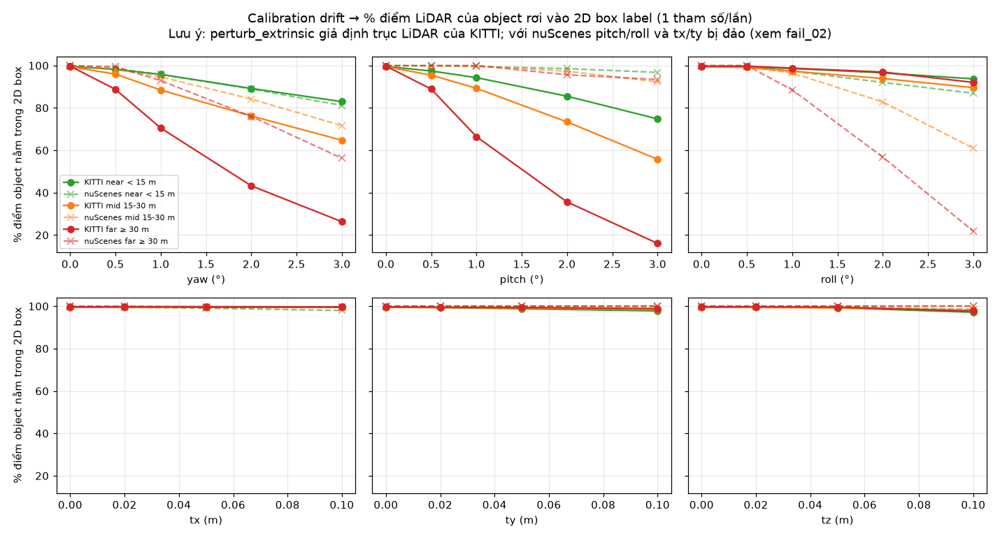
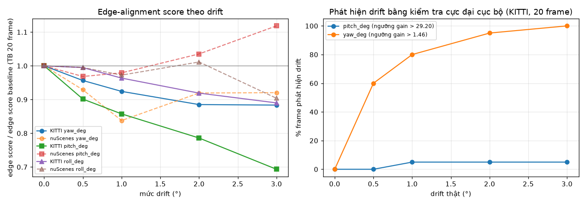
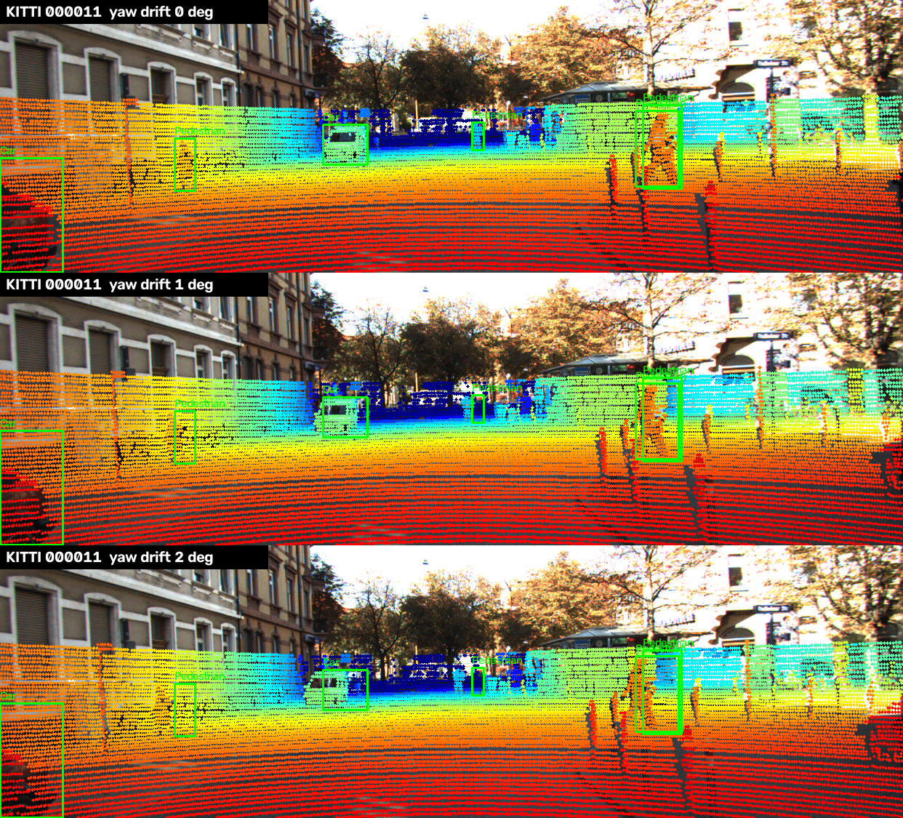
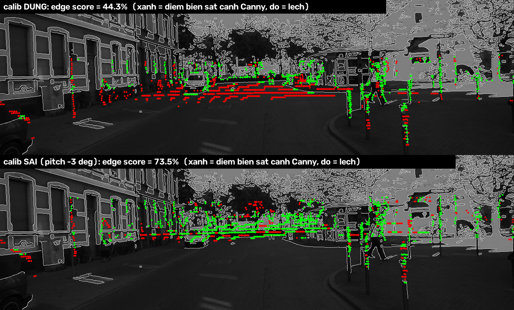
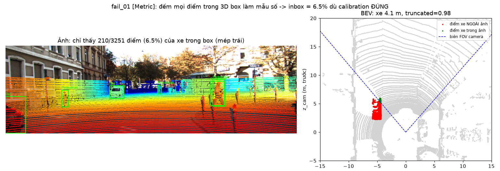
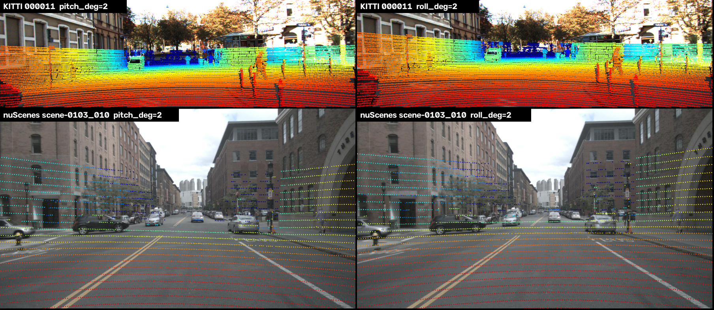

# Báo cáo Day 6: Kiểm tra calibration LiDAR-camera bằng projection

- **Họ tên:** Trương Thị Lan Anh
- **MSSV:** 2A202602451
- **Lớp:** VinUni AI20K · Track 4
- **Link repo:** https://github.com/SxAinsworth/TruongThiLanAnh-2A202602451-Track4-Day21
- **Topic:** A — LiDAR-camera projection QA
- **Dataset:** data/kitti_mini (chính), data/nuscenes_mini_subset (so sánh, bonus B5), data/synthetic (debug CP2)
- **Các frame đã dùng:** kitti_mini: toàn bộ 20 frame (000001 … 000061); nuScenes: 20 keyframe `scene-0103_000, _004, …, _036` và `scene-1094_000, _004, …, _036` (1 frame mỗi 4); synthetic: 000000

## 1. Claim

Trên `kitti_mini` (20 frame, 106 object), **lệch yaw 1° làm % điểm LiDAR của object rơi đúng vào 2D box giảm từ 99.7% xuống 70.5% với object ≥ 30 m, nhưng chỉ xuống 95.8% với object < 15 m.** Pitch còn nhạy hơn (66.4% ở ≥ 30 m). Ngược lại, lệch tịnh tiến tới 10 cm làm giảm ≤ 2.5 điểm % ở mọi khoảng cách. Drift yaw ≥ 1° **phát hiện được không cần label** trên 80% frame bằng edge-alignment score, nhưng drift pitch thì **không** (xem mục 3).

*Claim nháp ở CP1 đúng một nửa:* phần yaw đúng (far mất 29 điểm > 10, near mất 3.8 < 5); phần "tịnh tiến ảnh hưởng xe gần nhiều hơn" **không được chứng minh**: 10 cm gần như không ảnh hưởng ở cả ba nhóm khoảng cách (near 97.2–99.7%, far 97.6–99.7%).

## 2. Evidence

**Metric** (`src/calib_sweep.py`, mỗi lần chỉ đổi 1 tham số extrinsic, không có phép ngẫu nhiên → chạy lại cho CSV giống hệt, đã kiểm bằng `cmp`):
- *inbox*: % điểm LiDAR nằm trong 3D box GT (và trong ảnh lúc chưa lệch) được chiếu rơi vào 2D box label. Gộp theo khoảng cách object.
- *FOV*: số điểm chiếu vào ảnh / lúc chưa lệch. *edge*: % điểm biên độ sâu nằm cách cạnh Canny ≤ 3 px (không cần label).

| KITTI, mức drift | inbox near < 15 m | inbox mid 15–30 m | inbox far ≥ 30 m | FOV ratio | edge score (TB) |
|---|---|---|---|---|---|
| baseline | 99.6 | 99.5 | 99.7 | 1.000 | 56.4 |
| yaw 0.5° | 98.2 | 95.9 | 88.7 | 1.000 | 54.0 |
| **yaw 1°** | **95.8** | **88.4** | **70.5** | 1.001 | 52.1 |
| yaw 2° | 89.2 | 76.2 | 43.2 | 1.001 | 50.0 |
| yaw 3° | 83.0 | 64.8 | 26.3 | 1.001 | 49.8 |
| pitch 1° | 94.3 | 89.2 | 66.4 | 0.953 | 48.3 |
| pitch 3° | 74.8 | 55.8 | 16.1 | 0.857 | 39.4 |
| roll 3° | 93.7 | 89.6 | 92.0 | 1.002 | 50.1 |
| tx / ty / tz 10 cm | 99.7 / 97.8 / 97.2 | 99.5 / 98.4 / 98.1 | 99.7 / 98.9 / 97.6 | ≤ 1.046 | 56.0 / 55.2 / 54.0 |

- **Vì sao xa nhạy hơn:** xoay 1° dịch mọi điểm khoảng f·tan(1°) ≈ 721 × 0.0175 ≈ 12.6 px *bất kể khoảng cách*, trong khi box của xe ở 45 m chỉ rộng khoảng 30–40 px. Tịnh tiến 10 cm dịch f·t/z ≈ 14 px ở 5 m nhưng box xe ở 5 m rộng hàng trăm px, nên gần như không ảnh hưởng.
- **Theo class** (`results/yaw_inbox_by_class_kitti.csv`): ở yaw 1°, người đi bộ/cyclist ≥ 30 m chỉ còn **16.4%** điểm trong box (xe: 78.0%), vì box hẹp. Đây là nhóm chịu rủi ro lớn nhất.
- **FOV ratio gần như không đổi** khi lệch yaw (1.001). Metric "% điểm trong FOV" của đề bài **không phát hiện được drift yaw**, phải dùng metric theo object hoặc theo cạnh ảnh.
- **Phát hiện drift không cần label** (`src/drift_detect.py`): thử xoay calib thêm ±0.5…3°, nếu có góc làm edge score tăng hơn ngưỡng thì báo drift. Ngưỡng = gain lớn nhất trên 20 frame có calib đúng (0 báo động giả trên tập này; lưu ý ngưỡng chọn trên cùng tập dữ liệu, 20 frame là ít). Kết quả yaw: phát hiện **60% / 80% / 95% / 100%** frame ở drift 0.5 / 1 / 2 / 3°, ước lượng đúng góc lệch (median est = drift thật). Pitch: chỉ 0–5%, xem fail_03.
- **B5: KITTI và nuScenes** (`results/calib_sweep_nusc.csv`): yaw 1° ở far: KITTI 70.5% so với nuScenes 92.9%; yaw 3°: 26.3% so với 56.3%. nuScenes ít nhạy hơn vì (1) 2D box của nuScenes là box bao 8 góc 3D chiếu lên, rộng hơn box KITTI gán tay; (2) nhóm far của nuScenes chỉ có 9 object, median 33 m, không có người đi bộ (KITTI: 34 object, median 44 m, 21% người/cyclist). Edge score **không dùng được** trên nuScenes 32 beam: keyframe quá thưa, cửa sổ 7 px tìm được 0 điểm biên, và với cửa sổ 15 px score vẫn chỉ dao động 18–23% và không giảm theo drift.





Overlay calib đúng ở 3 khoảng cách (Basic): vật gần dưới 6 m `overlay_000025_*.png`, nhiều người đi bộ 6–35 m `overlay_000011_*.png`, xe xa hơn 50 m `overlay_000009_*.png`, nuScenes `overlay_scene-0103_010_*.png` (cùng trong `results/figures/`). Nguồn ảnh: KITTI Vision Benchmark Suite, nuScenes (Motional).

## 3. Failure case

**fail_03 [Metric/Preprocess]: edge score có cực đại giả theo pitch → không phát hiện được drift pitch.** Ở frame 000011 với calib **đúng**, score = 44.3%; xoay pitch −3° (calib **sai**) score lại lên **73.5%**. Nguyên nhân: ở xa, khoảng cách giữa 2 vạch quét mặt đất liên tiếp vượt quá 1 m nên bị tính là "biên độ sâu" (điểm đỏ nằm ngang trên mặt đường trơn, không có cạnh ảnh). Xoay pitch đẩy các vạch này lên trùng với chân tường và cạnh ngang của mặt tiền nhà. Vì vậy ngưỡng pitch bị đẩy lên 29.2 và tỉ lệ phát hiện chỉ 0–5%. Yaw không bị vì các vạch ngang này dịch theo chiều ngang thì vẫn nằm trên mặt đường. **Khắc phục:** lọc mặt đất (RANSAC) trước khi tìm biên, chỉ dùng biên theo chiều ngang của ring, và gộp gain qua nhiều frame thay vì quyết định từng frame.



**fail_01 [Metric]: object bị cắt ở rìa ảnh.** Bản đầu tiên của metric lấy *mọi* điểm trong 3D box làm mẫu số → nhóm near chỉ đạt **59%** dù calib đúng. Xe ở 4.1 m, frame 000011 (truncated = 0.98) chỉ có 210/3251 điểm (6.5%) nằm trong ảnh. Đã sửa: mẫu số chỉ gồm điểm nằm trong ảnh lúc chưa lệch (near baseline lên 99.6%). Cách đo cũ vẫn chạy được bằng cờ `--all-object-points`.



**fail_02 [Geometry]: trục perturb sai với nuScenes.** `perturb_extrinsic` giả định trục LiDAR của KITTI (x trước, y trái), nhưng LiDAR nuScenes có x phải, y trước. Kết quả là "pitch 3°" trên nuScenes thực ra là roll (far vẫn 93.4%), còn "roll 3°" thực ra là pitch (far rơi xuống 21.9%). Tương tự tx/ty bị đảo. Ảnh `fail_02_nuscenes_pitch_roll_axes_swapped.png` cho thấy cùng lệnh `pitch=2` làm KITTI lệch dọc nhưng làm nuScenes xoay nghiêng. Phát hiện: luôn ghi rõ frame của phép perturb, và test bằng một điểm phía trước xe (ví dụ (0, 10, 0) cho nuScenes) trước khi chạy sweep.



## 4. Khuyến nghị nếu triển khai thật

- **Use-case:** ADAS dùng fusion LiDAR-camera (ví dụ gán class camera cho cluster LiDAR, hoặc đo khoảng cách người đi bộ). Bracket lệch 1° sau va chạm nhẹ làm người đi bộ ≥ 15 m mất 70–84% điểm khỏi box, nghĩa là fusion có thể gán sai khoảng cách hoặc bỏ sót người. **Dung sai đề xuất: ≤ 0.5° cho góc**, còn tịnh tiến ≤ 10 cm thì chấp nhận được.
- **Trả lời câu hỏi đề bài:** lệch yaw 1° tự phát hiện được trên 80% frame KITTI bằng edge score, ảnh hưởng thấy rõ từ khoảng 15 m (người đi bộ) đến 30 m (xe). Lệch pitch 1° **chưa** phát hiện tin cậy được bằng phương pháp hiện tại.
- **Trade-off:** kiểm tra cực đại cục bộ tốn 9 lần chiếu cho mỗi trục mỗi frame (khoảng 30 ms mỗi lần chiếu trên CPU i7-1185G7, Python). Nên chạy ở 1 Hz trong luồng nền thay vì mỗi frame, và chỉ báo động khi median gain qua khoảng 30 frame vượt ngưỡng để giảm báo động giả. Edge score cần LiDAR dày (64 beam). Với 32 beam phải gộp nhiều sweep.
- **Chỉ số cần ghi log:** edge score và gain theo từng trục, góc drift ước lượng (median trượt), % điểm trong FOV, % điểm LiDAR rơi vào box của detection camera có độ tin cậy cao, và độ lệch timestamp LiDAR–camera.
- **Bước tiếp theo:** lọc mặt đất trước khi tìm biên để sửa fail_03, đặt ngưỡng trên tập frame riêng (không trùng tập đánh giá), và dùng chuỗi frame liên tục thay cho các frame rời rạc.

## 5. Cách chạy lại

Các lệnh tái tạo lại toàn bộ kết quả từ repo sạch. Tất cả script trong `src/` đều có `--help`.

```bash
python -m venv .venv
.venv\Scripts\activate                    # Linux/macOS: source .venv/bin/activate
set PYTHONUTF8=1                          # Windows cmd (PowerShell: $env:PYTHONUTF8=1); để pip đọc được requirements.txt có tiếng Việt
pip install -r requirements.txt

# Cách nhanh: chạy lần lượt mọi phần CP0 -> CP5 (khoảng 1 phút). Xem danh sách phần: --list
python -m src.run_all
# Hoặc chạy riêng từng phần, ví dụ: python -m src.run_all --steps cp3_sweep_kitti cp4_figures
# Các lệnh tương đương, từng bước:

# CP0: kiểm tra dữ liệu
python tools/verify_data.py --data-root data/kitti_mini
python tools/verify_data.py --data-root data/nuscenes_mini_subset
python -m starter.data_health --data-root data/synthetic

# CP2: self-test 2 hàm TODO (điểm (10,0,0) -> z_cam 9.73, pixel (614,175); loại NaN / sau camera / ngoài ảnh)
python -m src.test_projection
# CP2: demo projection (calib đúng) ở 3 khoảng cách + nuScenes
python -m starter.projection --data-root data/synthetic --frame 000000
python -m starter.projection --data-root data/kitti_mini --frame 000025
python -m starter.projection --data-root data/kitti_mini --frame 000011
python -m starter.projection --data-root data/kitti_mini --frame 000009
python -m starter.projection --data-root data/nuscenes_mini_subset --frame scene-0103_010

# CP3: sweep drift (khoảng 15 s và 5 s) + phát hiện drift (khoảng 1 phút)
python -m src.calib_sweep --data-root data/kitti_mini --out results/calib_sweep_kitti.csv
python -m src.calib_sweep --data-root data/nuscenes_mini_subset --frame-step 4 --edge-window 15 --out results/calib_sweep_nusc.csv
python -m src.drift_detect --data-root data/kitti_mini --out results/drift_detect_kitti.csv

# CP3-CP4: toàn bộ biểu đồ, ảnh demo, ảnh fail_*
python -m src.make_figures
```

## 6. Khai báo sử dụng AI

| Công cụ | Dùng cho việc gì | Bạn đã kiểm chứng thế nào |
|---|---|---|
| Claude Code (Claude Opus 5.5) | Đọc và tóm tắt đề bài; viết 2 hàm TODO trong `starter/projection.py`; viết `src/calib_sweep.py`, `src/drift_detect.py`, `src/make_figures.py`; gợi ý thiết kế metric (inbox, edge score, kiểm tra cực đại cục bộ); hỗ trợ viết REPORT | Test tay điểm (10, 0, 0) → z_cam = 9.727, (u, v) = (614.0, 175.0) đúng như CHECKPOINTS; test điểm NaN/Inf/sau camera bị loại; xem overlay KITTI/nuScenes bằng mắt; chạy lại sweep và so CSV bằng `cmp` (giống hệt); tự kiểm tra các con số bất thường (near baseline 59% → tìm ra fail_01; nuScenes pitch/roll đảo → fail_02; ngưỡng pitch 29.2 → fail_03) bằng cách xem bảng theo object/frame và ảnh |
