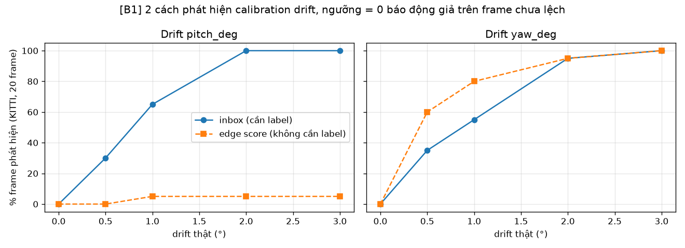
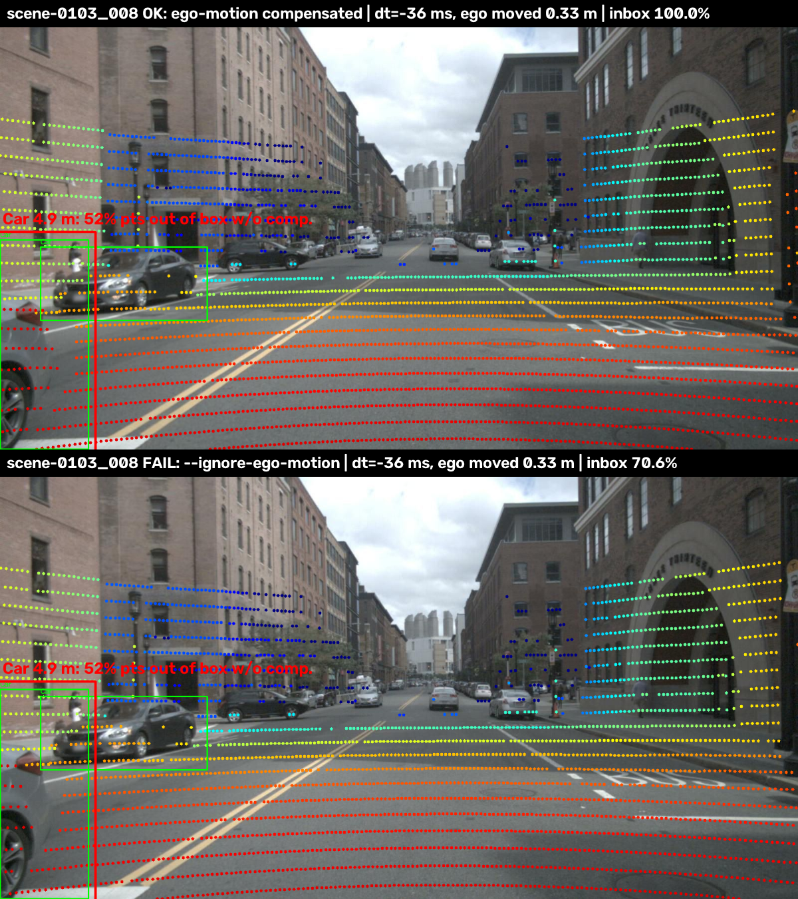

# Báo cáo Day 6: Độ nhạy của LiDAR-camera projection với calibration drift

- **Họ tên:** Trương Thị Lan Anh
- **MSSV:** 2A202602451
- **Lớp:** VinUni AI20K · Track 4
- **Link repo:** https://github.com/SxAinsworth/TruongThiLanAnh-2A202602451-Track4-Day21
- **Topic:** A — LiDAR-camera projection QA
- **Dataset:** data/kitti_mini (chính), data/nuscenes_mini_subset (so sánh, B5, lỗi Time), data/synthetic (self-test CP2)
- **Các frame đã dùng:** kitti_mini: toàn bộ 20 frame (000001 … 000061, đủ 7 tình huống: người đi bộ, cyclist, đông xe, xe xa, vật gần, che khuất, van/truck); nuScenes: 20 keyframe `scene-0103_000, _004, …, _036` và `scene-1094_000, _004, …, _036` cho sweep, cả 80 keyframe cho lỗi Time; synthetic: 000000

## 1. Claim

**Claim cuối cùng:** Trên `kitti_mini` (20 frame, 106 object), lệch **yaw 1°** làm % điểm LiDAR của object rơi đúng vào 2D box giảm từ **99.7% xuống 70.5% với object ≥ 30 m**, nhưng chỉ xuống **95.8% với object < 15 m**. Với người đi bộ/cyclist ≥ 30 m chỉ còn **16.4%**. Ngược lại, lệch tịnh tiến tới 10 cm làm giảm ≤ 2.5 điểm % ở mọi khoảng cách. Drift yaw ≥ 1° **phát hiện được không cần label** trên 80% frame bằng edge-alignment score; drift pitch thì không (fail_03).

**Claim nháp ở CP1** ("yaw 1° làm xe ≥ 30 m mất > 10% điểm, xe < 15 m mất < 5%; tịnh tiến 5 cm ảnh hưởng xe gần nhiều hơn") **đúng một nửa:** phần yaw đúng (far mất 29 điểm, near mất 3.8 điểm), phần tịnh tiến **bị bác bỏ**, vì 10 cm gần như không ảnh hưởng ở cả ba nhóm khoảng cách (near 97.2–99.7%, far 97.6–99.7%).

## 2. Evidence

**Metric** (`src/calib_sweep.py`, mỗi lần chỉ đổi 1 tham số extrinsic, không có phép ngẫu nhiên → chạy lại cho CSV giống hệt, đã kiểm bằng `cmp`):
- *inbox*: % điểm LiDAR nằm trong 3D box GT (và trong ảnh lúc chưa lệch) được chiếu rơi vào 2D box label, gộp theo khoảng cách object.
- *FOV*: số điểm chiếu vào ảnh / lúc chưa lệch. *edge*: % điểm biên độ sâu nằm cách cạnh Canny ≤ 3 px (không cần label).

| KITTI, mức drift | inbox near < 15 m | inbox mid 15–30 m | inbox far ≥ 30 m | FOV ratio | edge score (TB) |
|---|---|---|---|---|---|
| baseline | 99.6 | 99.5 | 99.7 | 1.000 | 56.4 |
| yaw 0.5° | 98.2 | 95.9 | 88.7 | 1.000 | 54.0 |
| **yaw 1°** | **95.8** | **88.4** | **70.5** | 1.001 | 52.1 |
| yaw 2° | 89.2 | 76.2 | 43.2 | 1.001 | 50.0 |
| yaw 3° | 83.0 | 64.8 | 26.3 | 1.001 | 49.8 |
| pitch 1° | 94.3 | 89.2 | 66.4 | 0.953 | 48.3 |
| pitch 3° | 74.8 | 55.8 | 16.1 | 0.857 | 39.4 |
| roll 3° | 93.7 | 89.6 | 92.0 | 1.002 | 50.1 |
| tx / ty / tz 10 cm | 99.7 / 97.8 / 97.2 | 99.5 / 98.4 / 98.1 | 99.7 / 98.9 / 97.6 | ≤ 1.046 | 56.0 / 55.2 / 54.0 |

- **Vì sao xa nhạy hơn:** xoay 1° dịch mọi điểm khoảng f·tan(1°) ≈ 721 × 0.0175 ≈ 12.6 px *bất kể khoảng cách*, trong khi box của xe ở 45 m chỉ rộng khoảng 30–40 px. Tịnh tiến 10 cm dịch f·t/z ≈ 14 px ở 5 m, nhưng box xe ở 5 m rộng hàng trăm px.
- **Theo class** (`results/yaw_inbox_by_class_kitti.csv`): ở yaw 1°, người đi bộ/cyclist ≥ 30 m còn **16.4%** điểm trong box, xe còn **78.0%**, vì box của người hẹp.
- **Script mẫu codelab** (`src/exp_yaw_sweep.py`, `results/yaw_perturb_sweep.csv`): 15/15 giá trị `hit_ratio` khớp bảng kỳ vọng. Frame 000011 (nhiều người đi bộ) giảm từ 99.5% xuống **77.4%** ở 1°, frame 000008 (đông xe) vẫn **98.6%**.
- **FOV ratio gần như không đổi** khi lệch yaw (1.001; synthetic 000000: 3910 → 3956 điểm ở 2°): metric "số điểm trong ảnh" **không phát hiện được drift yaw**.
- **Phát hiện drift không cần label** (`src/drift_detect.py`): thử xoay calib thêm ±0.5…3°, nếu có góc làm edge score tăng hơn ngưỡng thì báo drift. Ngưỡng = gain lớn nhất trên 20 frame có calib đúng (0 báo động giả trên tập này; ngưỡng chọn trên cùng tập, 20 frame là ít). Yaw: phát hiện **60% / 80% / 95% / 100%** frame ở drift 0.5 / 1 / 2 / 3°, góc ước lượng (median) đúng bằng drift thật. Pitch: 0–5% (fail_03).


Overlay calib đúng ở 3 khoảng cách (Basic): vật gần dưới 6 m `overlay_000025_*.png`, nhiều người đi bộ 6–35 m `overlay_000011_*.png`, xe xa hơn 50 m `overlay_000009_*.png`, nuScenes `overlay_scene-0103_010_*.png` (cùng trong `results/figures/`). Nguồn ảnh: KITTI Vision Benchmark Suite, nuScenes (Motional).

**[B5] KITTI và nuScenes** (`results/calib_sweep_nusc.csv`): yaw 1° ở far: KITTI 70.5% so với nuScenes 92.9%; yaw 3°: 26.3% so với 56.3%. Tiêu cự nuScenes lớn hơn (1253 so với 721 px) nên lệch 1° dịch khoảng 1253 × 0.0175 ≈ 21.9 px thay vì 12.6 px, nhưng box cùng vật cũng to hơn đúng theo tỉ lệ đó, nên hai yếu tố triệt tiêu nhau. nuScenes ít nhạy hơn vì (1) 2D box nuScenes là box bao 8 góc 3D chiếu lên, rộng hơn box KITTI gán tay; (2) nhóm far của nuScenes chỉ có 9 object, median 33 m, không có người đi bộ (KITTI: 34 object, median 44 m, 21% người/cyclist). Edge score **không dùng được** trên nuScenes 32 beam: keyframe quá thưa, cửa sổ 7 px tìm được 0 điểm biên, với cửa sổ 15 px score chỉ dao động 18–23% và không giảm theo drift. Ngoài ra trục perturb bị đảo trên nuScenes (fail_02).

**[B1] So sánh 2 cách phát hiện drift** trên cùng 20 frame KITTI (`results/bonus_b1_inbox_vs_edge.csv`, `src/bonus_compare.py`). Cả hai đặt ngưỡng 0 báo động giả trên frame chưa lệch.

| Drift | inbox (cần label, ngưỡng 92.0%) | edge score (không cần label, ngưỡng gain 1.46 / 29.2) |
|---|---|---|
| yaw 0.5° / 1° / 2° | 35% / 55% / 95% frame | **60% / 80% / 95%** frame |
| pitch 0.5° / 1° / 2° | **30% / 65% / 100%** frame | 0% / 5% / 5% frame |

Inbox ổn định với mọi trục, nhưng cần label và có "mức sàn" 92% do label người vẽ không khớp tuyệt đối với 3D box (frame kém nhất), nên kém nhạy ở drift nhỏ. Edge score không cần label, nhạy hơn với yaw, nhưng bị cực đại giả theo pitch (fail_03) và không dùng được với LiDAR 32 beam. **Kết luận:** QA offline dùng inbox, giám sát online dùng edge score cho yaw.



**[B3] Latency** (`results/latency_kitti.csv`, `src/latency.py`; 21 lần chạy, bỏ lần đầu, báo p50/p95 trên 20 lần; Intel Core i7-1185G7 @ 3.00 GHz, RAM 16 GB, chỉ CPU, Python 3.11; frame 000011, 108 004 điểm): projection p50 **9.0 ms** / p95 10.3 ms; edge score 12.2 / 15.0 ms; bản đồ cạnh Canny 4.7 / 5.5 ms; drift check 1 trục (9 lần edge score) **112 / 136 ms**.

## 3. Failure case

**fail_03 [Metric/Preprocess]: edge score có cực đại giả theo pitch → không phát hiện được drift pitch.**
- **Trường hợp:** KITTI 000011, kiểm tra drift theo trục pitch bằng edge score.
- **Quan sát:** với calib **đúng**, score = 44.3%; xoay pitch −3° (calib **sai**) score lại lên **73.5%**. Ngưỡng pitch vì vậy bị đẩy lên 29.2, tỉ lệ phát hiện chỉ 0–5%.
- **Nguyên nhân:** ở xa, khoảng cách giữa 2 vạch quét mặt đất liên tiếp vượt quá 1 m nên bị tính là "biên độ sâu" (điểm đỏ nằm ngang trên mặt đường trơn, không có cạnh ảnh). Xoay pitch đẩy các vạch này lên trùng với chân tường và cạnh ngang của mặt tiền nhà. Yaw không bị vì các vạch ngang này dịch theo chiều ngang thì vẫn nằm trên mặt đường.
- **Cách phát hiện / khắc phục:** lọc mặt đất (RANSAC) trước khi tìm biên, chỉ dùng biên theo chiều ngang của ring, gộp gain qua nhiều frame; khi chạy thật dùng inbox trên detection camera tin cậy cao để kiểm tra chéo trục pitch (B1).


**fail_04 [Time]: chiếu LiDAR nuScenes mà không bù chuyển động xe** (`src/fail_time_sync.py`, `results/time_sync_nusc.csv`, cả 80 keyframe).
- **Trường hợp:** nuScenes, `--ignore-ego-motion`; label và điểm của object lấy từ bản có bù (đúng), chỉ chiếu điểm bằng calib không bù.
- **Quan sát:** scene-0103_010: số điểm vào ảnh 3120 → 2911. Frame tệ nhất scene-0103_008: inbox 100% → **70.6%**, xe ở 4.9 m bên trái mất **52%** điểm khỏi box. Trung bình 80 frame: 99.96% → 96.7%, 7/80 frame dưới 90%.
- **Nguyên nhân:** camera chụp sớm hơn LiDAR khoảng 35.5 ms (34.2–39.5 ms); xe chạy khoảng 6.9 m/s nên đi được khoảng 0.25 m. Đây là sai lệch tịnh tiến theo hướng đi, nên vật gần dịch nhiều (median **16 px** ở < 15 m) còn vật xa gần như không (2.3 px ở ≥ 30 m), và điểm của vật gần nở ra phía mép ảnh rồi rơi ra ngoài.
- **Cách phát hiện khi chạy thật:** log `|t_camera − t_lidar| × tốc độ xe` mỗi frame; cảnh báo nếu vượt 0.1 m mà bước bù chuyển động (deskew/ego-motion) đang tắt hoặc thiếu ego pose.



**fail_01 [Metric]: object bị cắt ở rìa ảnh.** Bản đầu tiên của metric lấy *mọi* điểm trong 3D box làm mẫu số → nhóm near chỉ đạt **59%** dù calib đúng. Xe ở 4.1 m, frame 000011 (truncated = 0.98) chỉ có 210/3251 điểm (6.5%) nằm trong ảnh. Đã sửa: mẫu số chỉ gồm điểm nằm trong ảnh lúc chưa lệch (near baseline lên 99.6%). Cách đo cũ vẫn chạy được bằng cờ `--all-object-points`.


**fail_02 [Geometry]: trục perturb sai với nuScenes.** `perturb_extrinsic` giả định trục LiDAR của KITTI (x trước, y trái), nhưng LiDAR nuScenes có x phải, y trước. Kết quả là "pitch 3°" trên nuScenes thực ra là roll (far vẫn 93.4%), còn "roll 3°" thực ra là pitch (far rơi xuống 21.9%); tx/ty cũng bị đảo. Phát hiện: luôn ghi rõ frame của phép perturb, và test bằng một điểm phía trước xe (ví dụ (0, 10, 0) cho nuScenes) trước khi chạy sweep.


## 4. Khuyến nghị nếu triển khai thật

- **Use-case:** xe giao hàng tự hành trong khu đô thị (< 30 km/h) dùng fusion LiDAR-camera để gán class camera cho cluster LiDAR và đo khoảng cách tới người đi bộ. Bracket lệch 1° sau va chạm nhẹ làm người đi bộ ≥ 15 m mất 70–84% điểm khỏi box, tức là fusion có thể gán sai khoảng cách hoặc bỏ sót người. **Dung sai đề xuất: ≤ 0.5° cho góc**, tịnh tiến ≤ 10 cm chấp nhận được.
- **Trả lời câu hỏi đề bài:** lệch yaw 1° tự phát hiện được trên 80% frame KITTI bằng edge score; ảnh hưởng thấy rõ từ khoảng 15 m (người đi bộ) đến 30 m (xe). Lệch pitch 1° chỉ phát hiện được bằng inbox (65% frame), cần label hoặc detection camera tin cậy.
- **Trade-off:** drift check 1 trục tốn 112 ms p50 (136 ms p95) CPU, gấp khoảng 12 lần một lần chiếu (9 ms), không chạy được mỗi frame ở 10 Hz cùng các module khác. Chạy ở 1 Hz trong luồng nền hoặc khi xe dừng đèn đỏ thì tiết kiệm CPU nhưng phát hiện chậm hơn vài giây. Edge score cần LiDAR dày (64 beam); 32 beam phải gộp nhiều sweep. Mọi bước chiếu phải bù chuyển động: bỏ bù làm vật gần lệch khoảng 16 px ở 7 m/s (fail_04).
- **Chỉ số cần ghi log:** (1) edge-score gain và góc drift ước lượng theo từng trục, median trượt 30 giây, cảnh báo khi gain > 1.5 trong 5 phút liên tục; (2) inbox của điểm LiDAR trong box detection camera tin cậy cao, cảnh báo khi < 92% (mức sàn đo được); (3) `|t_camera − t_lidar| × tốc độ`, cảnh báo khi > 0.1 m; (4) % điểm trong FOV, chỉ để bắt lỗi I/O, không dùng để phát hiện drift; (5) nhiệt độ giá đỡ cảm biến, để biết lệch do va chạm hay giãn nở nhiệt.
- **Bước tiếp theo:** lọc mặt đất trước khi tìm biên để sửa fail_03, đặt ngưỡng trên tập frame riêng (không trùng tập đánh giá), dùng chuỗi frame liên tục thay cho frame rời rạc.

## 5. Cách chạy lại

Các lệnh tái tạo lại toàn bộ kết quả từ repo sạch. **[B4]** Mọi script trong `src/` đều có `--help` và chạy được không cần tham số.

```bash
python -m venv .venv
.venv\Scripts\activate                    # Linux/macOS: source .venv/bin/activate
set PYTHONUTF8=1                          # Windows cmd (PowerShell: $env:PYTHONUTF8=1); để pip đọc được requirements.txt có tiếng Việt
pip install -r requirements.txt

# Cách nhanh: chạy lần lượt mọi phần CP0 -> CP5 + bonus (khoảng 1 phút). Xem danh sách phần: --list
python -m src.run_all
# Hoặc chạy riêng từng phần, ví dụ: python -m src.run_all --steps cp3_sweep_kitti cp4_figures
# Các lệnh tương đương, từng bước:

# CP0: kiểm tra dữ liệu
python tools/verify_data.py --data-root data/kitti_mini
python tools/verify_data.py --data-root data/nuscenes_mini_subset
python -m starter.data_health --data-root data/synthetic
python -m starter.data_health --data-root data/kitti_mini --out results/data_health_kitti.csv
python -m starter.data_health --data-root data/nuscenes_mini_subset --out results/data_health_nusc.csv

# CP2: self-test 2 hàm TODO (điểm (10,0,0) -> z_cam 9.73, pixel (614,175); loại NaN / sau camera / ngoài ảnh)
python -m src.test_projection
# CP2: demo projection (calib đúng) ở 3 khoảng cách + nuScenes
python -m starter.projection --data-root data/synthetic --frame 000000
python -m starter.projection --data-root data/kitti_mini --frame 000025
python -m starter.projection --data-root data/kitti_mini --frame 000011
python -m starter.projection --data-root data/kitti_mini --frame 000009
python -m starter.projection --data-root data/nuscenes_mini_subset --frame scene-0103_010

# CP3: script mẫu codelab (đối chiếu bảng kỳ vọng) + sweep drift + phát hiện drift (khoảng 1 phút)
python -m src.exp_yaw_sweep --data-root data/kitti_mini --frames 000008 000011 000049
python -m src.plot_yaw_sweep
python -m src.calib_sweep --data-root data/kitti_mini --out results/calib_sweep_kitti.csv
python -m src.calib_sweep --data-root data/nuscenes_mini_subset --frame-step 4 --edge-window 15 --out results/calib_sweep_nusc.csv
python -m src.drift_detect --data-root data/kitti_mini --out results/drift_detect_kitti.csv

# CP4: biểu đồ, ảnh demo, fail_01..03; fail_04 (lỗi Time trên nuScenes)
python -m src.make_figures
python -m src.fail_time_sync

# Bonus: [B1] inbox vs edge score, [B3] latency (số ms thay đổi nhẹ giữa các lần chạy)
python -m src.bonus_compare
python -m src.latency

# CP5
python tools/check_submission.py
```

## 6. Khai báo sử dụng AI

| Công cụ | Dùng cho việc gì | Bạn đã kiểm chứng thế nào |
|---|---|---|
| Claude Code (Claude Opus 5.5) | Đọc và tóm tắt đề bài; viết 2 hàm TODO trong `starter/projection.py`; viết toàn bộ script trong `src/` (`calib_sweep`, `drift_detect`, `make_figures`, `fail_time_sync`, `bonus_compare`, `latency`, `run_all`, `test_projection`); gợi ý thiết kế metric (inbox, edge score, kiểm tra cực đại cục bộ); hỗ trợ viết REPORT | `src.test_projection` pass: (10, 0, 0) → z_cam = 9.73, (u, v) = (614, 175), NaN/sau camera/ngoài ảnh bị loại; 3 lệnh overlay ra đúng 3910 / 19946 / 3120 điểm; xem overlay KITTI/nuScenes bằng mắt; chạy lại sweep và so CSV bằng `cmp` (giống hệt); clone repo sang thư mục mới, chạy lại mục 5 ra cùng số; tự kiểm tra các con số bất thường (near baseline 59% → fail_01; nuScenes pitch/roll đảo → fail_02; ngưỡng pitch 29.2 → fail_03; ảnh fail_04 ban đầu ghi 0% do bỏ sót điểm ra ngoài ảnh → sửa) bằng bảng theo object/frame và ảnh |
| Codelab Day 6 | Script mẫu `src/exp_yaw_sweep.py`, `src/plot_yaw_sweep.py`, `src/test_projection.py` (giữ nguyên). Đã mở rộng trong `src/calib_sweep.py`: chia theo khoảng cách và class, thêm pitch/roll/tịnh tiến, chạy trên nuScenes, thêm edge score và phát hiện drift | Chạy script mẫu ra đúng 15/15 giá trị `hit_ratio` của bảng kỳ vọng; `calib_sweep` cho cùng xu hướng trên cùng frame |
